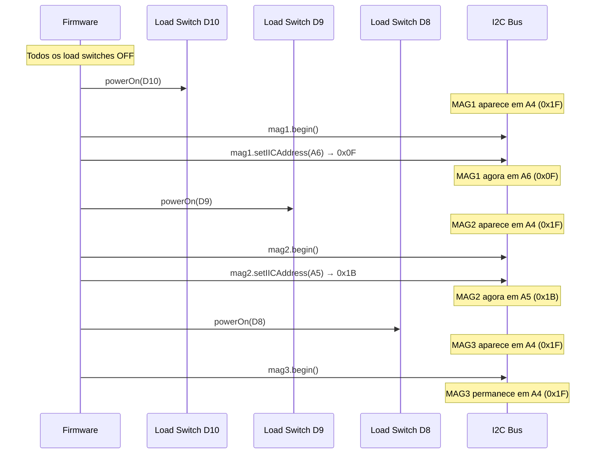

# Documento de Design — Migração de Sensor A1B6

## Visão Geral

Este documento descreve o design técnico para migrar o `SensorController` do firmware SpaceMouse do sensor TLI493D-A2B6 (geração 2) para o TLI493D-A1B6 (geração 1). A migração afeta dois arquivos: `SensorController.h` (declaração dos membros) e `SensorController.cpp` (inicialização, endereçamento e leitura).

### Escopo das Alterações

As mudanças são localizadas e de baixo risco:

1. **Tipo de sensor**: `TLx493D_A2B6` → `TLx493D_A1B6` (3 membros no header)
2. **Endereço padrão do construtor**: `TLx493D_IIC_ADDR_A0_e` → `TLx493D_IIC_ADDR_A4_e` (SDA baixo no boot neste hardware)
3. **Endereços de reatribuição**: usar enums do grupo A4–A7 (SDA baixo) em vez de A0–A3
4. **Remoção de `setSensitivity()`**: 3 chamadas removidas (A1B6 não suporta)
5. **Comentários de documentação**: diferenças entre gerações e mapa de endereços

### O que NÃO muda

- Interface pública do `SensorController` (métodos, assinaturas)
- Lógica de calibração (baseline, amostras)
- Lógica de power switch (GPIO, pinos, semântica HIGH/LOW)
- Formato de saída `readRaw(out[9])`
- Pipeline de transformação e demais módulos do firmware

## Arquitetura

A arquitetura do sistema permanece inalterada. O `SensorController` continua sendo o único ponto de contato com os sensores magnéticos, encapsulando:

```
┌─────────────────────────────────────────────────┐
│                  SensorController                │
│                                                  │
│  ┌──────────┐  ┌──────────┐  ┌──────────┐      │
│  │ mag1     │  │ mag2     │  │ mag3     │      │
│  │ A1B6     │  │ A1B6     │  │ A1B6     │      │
│  │ addr:A6  │  │ addr:A5  │  │ addr:A4  │      │
│  └────┬─────┘  └────┬─────┘  └────┬─────┘      │
│       │              │              │            │
│  ┌────┴─────┐  ┌────┴─────┐  ┌────┴─────┐      │
│  │ LS D10   │  │ LS D9    │  │ LS D8    │      │
│  │ (MAG1)   │  │ (MAG2)   │  │ (MAG3)   │      │
│  └──────────┘  └──────────┘  └──────────┘      │
│                                                  │
│              I2C Bus (Wire, 400kHz)              │
└─────────────────────────────────────────────────┘
```

### Sequência de Endereçamento I2C

O procedimento de power-on sequencial é essencial porque todos os A1B6 iniciam com o mesmo endereço padrão (A4 = 0x3E quando SDA está baixo no boot). A sequência atribui endereços distintos ligando um sensor por vez:



### Decisão de Design: Escolha dos Endereços A4–A7

**Contexto**: O hardware deste projeto mantém SDA baixo durante o boot dos sensores. Testes confirmaram que o endereço padrão é A4 (0x3E / 0x1F em 7-bit). Portanto, devemos usar exclusivamente endereços do grupo SDA-baixo (A4–A7).

**Mapa de endereços SDA-baixo (geração 1)**:

| Enum | 8-bit write | 7-bit | Uso neste projeto |
|------|-------------|-------|-------------------|
| `TLx493D_IIC_ADDR_A4_e` | 0x3E | 0x1F | MAG3 (padrão, sem reatribuição) |
| `TLx493D_IIC_ADDR_A5_e` | 0x36 | 0x1B | MAG2 (reatribuído) |
| `TLx493D_IIC_ADDR_A6_e` | 0x1E | 0x0F | MAG1 (reatribuído) |
| `TLx493D_IIC_ADDR_A7_e` | 0x16 | 0x0B | Reservado (não utilizado) |

**Justificativa**: MAG1 e MAG2 são reatribuídos para A6 e A5 respectivamente, liberando A4 para MAG3 que é o último a ligar e pode permanecer no endereço padrão. Isso minimiza operações de `setIICAddress()` (apenas 2 chamadas em vez de 3). A7 fica reservado para expansão futura.

## Componentes e Interfaces

### SensorController.h — Alterações

A única mudança no header é o tipo dos três membros de sensor:

```cpp
// ANTES (A2B6 — geração 2)
ifx::tlx493d::TLx493D_A2B6 mag1Sensor_;
ifx::tlx493d::TLx493D_A2B6 mag2Sensor_;
ifx::tlx493d::TLx493D_A2B6 mag3Sensor_;

// DEPOIS (A1B6 — geração 1)
ifx::tlx493d::TLx493D_A1B6 mag1Sensor_;
ifx::tlx493d::TLx493D_A1B6 mag2Sensor_;
ifx::tlx493d::TLx493D_A1B6 mag3Sensor_;
```

A interface pública permanece idêntica. Nenhum outro módulo do firmware precisa ser alterado.

### SensorController.cpp — Alterações

#### 1. Construtor

```cpp
// ANTES
SensorController::SensorController()
    : mag1Sensor_(Wire, TLx493D_IIC_ADDR_A0_e),
      mag2Sensor_(Wire, TLx493D_IIC_ADDR_A0_e),
      mag3Sensor_(Wire, TLx493D_IIC_ADDR_A0_e) {}

// DEPOIS
SensorController::SensorController()
    : mag1Sensor_(Wire, TLx493D_IIC_ADDR_A4_e),
      mag2Sensor_(Wire, TLx493D_IIC_ADDR_A4_e),
      mag3Sensor_(Wire, TLx493D_IIC_ADDR_A4_e) {}
```

O endereço inicial muda de `A0_e` (padrão SDA alto, gen 2) para `A4_e` (padrão SDA baixo, gen 1 neste hardware).

#### 2. Método `begin()` — Sequência de Endereçamento

```cpp
void SensorController::begin() {
  // ... (pinMode e powerOff inalterados) ...

  Wire.begin();
  Wire.setClock(400000);

  // MAG1: liga, inicializa, reatribui para A6 (0x1E / 0x0F)
  powerOn(Config::PIN_MAG1_LS);
  mag1Sensor_.begin(true, false, false, true);
  mag1Sensor_.setIICAddress(TLx493D_IIC_ADDR_A6_e);
  // setSensitivity() REMOVIDO — A1B6 opera apenas em full range
  delay(10);

  // MAG2: liga, inicializa, reatribui para A5 (0x36 / 0x1B)
  powerOn(Config::PIN_MAG2_LS);
  mag2Sensor_.begin(true, false, false, true);
  mag2Sensor_.setIICAddress(TLx493D_IIC_ADDR_A5_e);
  // setSensitivity() REMOVIDO
  delay(10);

  // MAG3: liga, inicializa, permanece em A4 (0x3E / 0x1F) — endereço padrão
  powerOn(Config::PIN_MAG3_LS);
  mag3Sensor_.begin(true, false, false, true);
  // setSensitivity() REMOVIDO
  // Não precisa de setIICAddress() — já está no endereço padrão A4
  delay(10);
}
```

#### 3. Método `readRaw()` — Sem Alteração Funcional

O método `readRaw()` não requer alterações. A API `getMagneticFieldAndTemperature()` é idêntica entre A1B6 e A2B6 (mesma assinatura, mesmos tipos `double*`). A diferença é apenas no fator de conversão interno (0.098 mT/LSB no A1B6 vs valores variáveis no A2B6 com sensibilidade configurável), mas isso é tratado internamente pela biblioteca.

#### 4. Comentários de Documentação

Serão adicionados comentários no topo do `.cpp` e junto às constantes relevantes documentando:
- Que os sensores são TLI493D-A1B6 (geração 1)
- Mapa de endereços I2C utilizado (grupo SDA-baixo: A4–A7)
- Que `setSensitivity()` não é suportado no A1B6 (full range apenas, 0.098 mT/LSB)
- Diferenças em relação ao A2B6

## Modelos de Dados

Não há alteração em modelos de dados. O `SensorController` continua produzindo `float out[9]` com a mesma semântica:

```
out[0..2] = MAG1 (x, y, z) em mT
out[3..5] = MAG2 (x, y, z) em mT
out[6..8] = MAG3 (x, y, z) em mT
```

O fator de conversão magnético muda internamente na biblioteca (0.098 mT/LSB para A1B6 full range), mas os valores de saída continuam em mT — a unidade é preservada pela biblioteca. A escala absoluta dos valores pode diferir do A2B6 com `EXTRA_SHORT_RANGE`, o que pode exigir recalibração dos ganhos em `Config.h`, mas isso está fora do escopo desta migração.

## Tratamento de Erros

### Erros Existentes (mantidos)

O código atual não verifica o retorno de `begin()`, `setIICAddress()` ou `getMagneticFieldAndTemperature()`. Este design mantém o mesmo nível de tratamento de erros para minimizar o escopo da migração.

### Risco Específico da Migração

- **`setSensitivity()` retornava `false` silenciosamente no A1B6**: removido, eliminando o risco.
- **Endereço I2C incorreto**: se `setIICAddress()` falhar, dois sensores ficarão no mesmo endereço e as leituras serão corrompidas. O comportamento é o mesmo do código atual com A2B6 — não há regressão.
- **Sensor não responde após `begin()`**: mesmo comportamento do código atual. Valores de leitura serão zero.

### Recomendação Futura (fora do escopo)

Adicionar verificação dos retornos booleanos de `begin()` e `setIICAddress()` com log de erro via Serial (quando telemetria habilitada). Isso beneficiaria tanto A1B6 quanto A2B6.

## Estratégia de Testes

### Abordagem

Esta migração é de firmware embarcado que interage diretamente com hardware I2C real. Não há lógica pura testável por property-based testing — as operações são chamadas a uma biblioteca de hardware com sensores físicos. A validação correta é por testes de integração no hardware real.

**Property-based testing NÃO se aplica** a esta feature porque:
- As funções modificadas (`begin()`, `setIICAddress()`, `getMagneticFieldAndTemperature()`) são chamadas diretas a uma biblioteca de hardware I2C
- Não há transformação de dados, parsing, serialização ou lógica pura no escopo da migração
- O comportamento depende inteiramente de sensores físicos conectados ao barramento I2C
- Testes automatizados sem hardware real não validariam a migração

### Testes Manuais no Hardware (obrigatórios)

| # | Teste | Critério de Sucesso | Valida Requisito |
|---|-------|---------------------|------------------|
| 1 | Compilação sem erros/warnings | Build limpo com PlatformIO | 1, 3 |
| 2 | I2C scan após `begin()` | 3 endereços distintos detectados: 0x0F, 0x1B, 0x1F | 2 |
| 3 | Leitura de campo magnético | `readRaw()` retorna 9 valores não-zero com ímã próximo | 4 |
| 4 | Calibração zero-offset | `beginCalibration()` → `updateCalibration()` × N → `calibrationDone()` retorna `true` | 5 |
| 5 | Power cycle completo | Desligar/religar todos os sensores, repetir scan I2C | 2, 6 |
| 6 | Ausência de `setSensitivity` no código | Grep no código confirma zero ocorrências | 3 |
| 7 | Operação do mouse 3D | Movimentos nos 6 eixos respondem corretamente no host | 4, 5 |

### Teste de Compilação (automatizável)

```bash
pio run -e seeed_xiao_rp2040
```

Este é o único teste que pode ser executado sem hardware. Valida que os tipos, enums e chamadas de API estão corretos sintaticamente.
